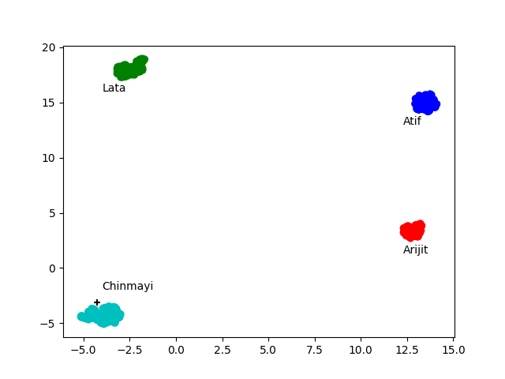

# sing-alike-interactive
This demo is a prototype of a system that tells you which popular artist you sound most like, based on a recorded sample of your singing voice. The implementation currently has been built with 4 Indian popular music artists - [Arijit Singh](https://open.spotify.com/artist/4YRxDV8wJFPHPTeXepOstw), [Atif Aslam](https://open.spotify.com/artist/2oSONSC9zQ4UonDKnLqksx), [Lata Mangeshkar](https://open.spotify.com/artist/61JrslREXq98hurYL2hYoc), [Chinmayi](https://open.spotify.com/artist/5UJ2sHO2ELrgW6aXeRLTQQ).

## How the system was built
We obtained some recordings of each artist, separated the vocals using [Spleeter](https://github.com/deezer/spleeter) and obtained embeddings on 10-second chunks using [Resemblyzer](https://github.com/resemble-ai/Resemblyzer). These embeddings are 256-length vectors, that are supposed to "encode" the essential characteristics of the voice. We then used the [supervised UMAP projection](https://umap-learn.readthedocs.io/en/latest/supervised.html#using-labels-to-separate-classes-supervised-umap) to learn a reduced 2-dimensional space for these embeddings.

Given a test sample, we first encode it, use the same projection to reduce its dimensionality and classify it using a simple [k-nearest neighbors](https://scikit-learn.org/stable/modules/generated/sklearn.neighbors.KNeighborsClassifier.html) method.

## How to use it
The demo is provided in the form of a python notebook with instructions in place, wherever needed.
* To run it on Google Colab, click on the 'Open In Colab' button at the top.
* To run it locally, you can use the 'demo_local.ipnb', but be sure to install the dependencies listed in the requirements file (do also check out the [dependencies](https://github.com/resemble-ai/Resemblyzer/blob/master/requirements_package.txt) that resemblyzer will install and note that pyaudio will require portaudio to be pre-installed)

## Acknowledgements
This tool was built as a hack during Music Hack Day India in December 2019, the first hackathon organised by [MusicTechCommunity India](https://musictechcommunity.org/).

## Contributors
* [Athithyan Paramasivan] ()
* [Rohit M A](https://github.com/rohitma38)

## ToDo
* Add scripts used for pre-processing and generating 2d embedding clusters
